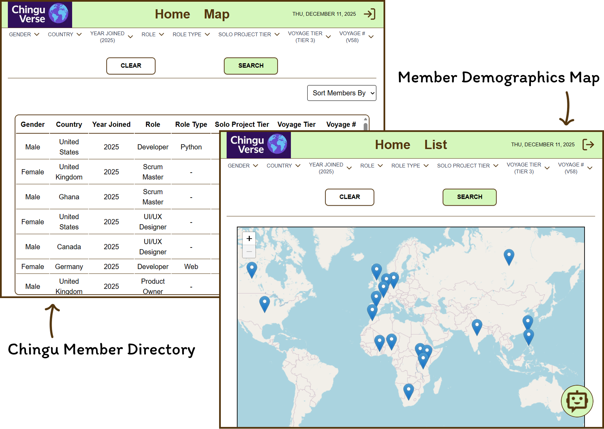

# ChinguVerse - Chingu Member Demographics Map

## Overview

The Chingu Member Demographics Map is a web application that displays demographic information about Chingu members across the world. It helps users explore where Chingus live, their roles, tiers, and other attributes all shown visually on an interactive world map and in a searchable list view.

This app was built as part of the Chingu Voyage Project(V58-TIER3-TEAM-32). It aims to help the community visualize Chingu demographics in a fun and interactive way.

### Links

- [LIVE LINK](https://chinguverse.vercel.app/)
- [Repository](https://github.com/chingu-voyages/v58-tier3-team-32)

## Contents

- [Features](#features)
- [Tech Used / Dependencies](#tech-used--dependencies)
- [Running the Project Locally](#running-the-project-locally)
- [API Reference](#api-reference)
- [Our Team](#our-team)
- [License](#license)

## Features

Users can:

- View where Chingus are located on a map.
- Filter displayed Chingus by multiple attributes (like role, tier, country, or gender).
- View detailed member data in a list.
- Register an account and login to access AI chat assistant.
- Chat with an AI assistant to learn how to use the app

## Tech Used / Dependencies

**Core Framework**

- Next.js

**Frontend**

- React
- TypeScript
- React Leaflet
- Tailwind CSS
- Lucide React

**Backend and API**

- Prisma
- REST API with Next.js Route Handlers
- Google GenAI - gemini 2.5 flash
- Firebase Authentication

**Tools and Collaboration**

- Docker
- Git and GitHub
- Jira
- Discord
- Google Meet

## Running the Project Locally

1. Make sure to have [Docker Desktop](https://www.docker.com/products/docker-desktop/) installed and running.
1. Clone the [repo](https://github.com/chingu-voyages/v58-tier3-team-32) (or your fork) and `cd` into it.
1. Create a `.env` file by copying from the `.env.example` file. Configure the environment variables if needed (defaults work for local development).
1. Run `docker compose up -d` in your bash/command line to run the database in the background. This will also seed the database in the first run.
1. Run `npm install` in your bash/command line to install the dependencies.
1. Run `npx prisma generate` in your bash/command line to generate the Prisma Client.
1. Run `npm run dev` in your bash/command line to run the development server.
1. Visit the [website](http://localhost:3000) locally.

## API Reference

For more information on the available endpoints, please refer to the dedicated [API documentation file](./API_REFERENCE.md).

## Our Team

- David: [GitHub](https://github.com/Daxyca) / [LinkedIn](https://linkedin.com/in/dxcallena)
- Ako: [GitHub](https://github.com/AkoKBIkeda) / [LinkedIn](https://linkedin.com/in/akiko-kb-ikeda)
- Bisi: [GitHub](https://github.com/skellynb) / [LinkedIn](https://linkedin.com/in/bisola-s-ogunsina)
- Tonia: [GitHub](https://github.com/MontgomeryT7294) / [LinkedIn](https://linkedin.com/in/tonia-montgomery)

## License

This project is licensed under the GNU General Public License v3.0.
See the [LICENSE](./LICENSE) file for details.

You may redistribute and/or modify this software under the terms of the GNU General Public License as published by the Free Software Foundation, either version 3 of the License or (at your option) any later version.
